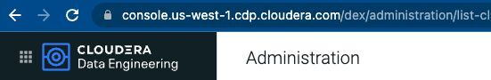
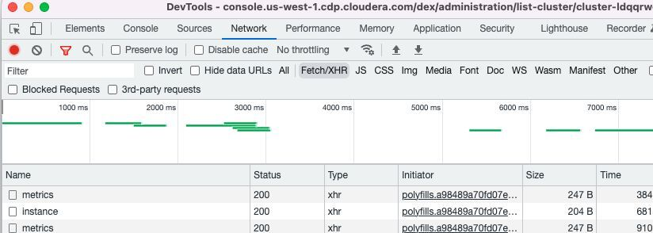
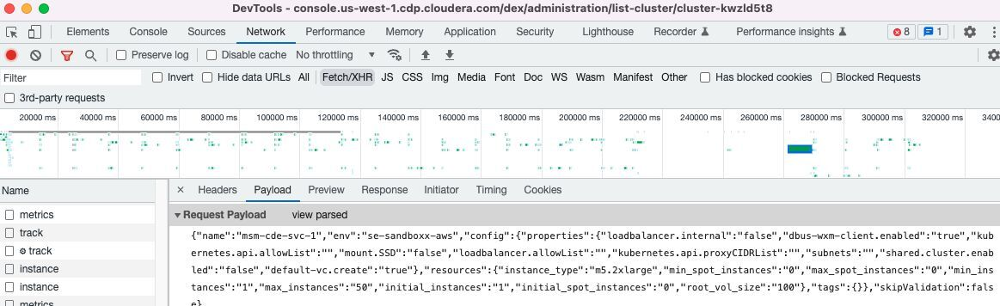
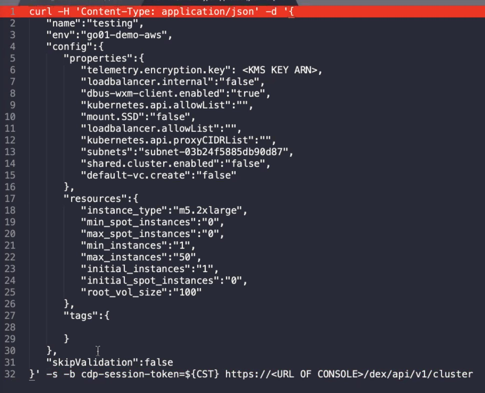

# CDE-cURL-Deployment
#### How to collect the JSON payload used for cURL-based deployment

## Background
Cloudera Data Platform (CDP) is designed for flexibility. Users may create a variety of configuration options to meet their needs. While many configuration options are available via the user interface, there are even more configuration options available using available APIs. 

Using APIs for deploying services is useful for different scenarios, including:
* Deploying and managing CDE Services via code
* Applying configurations which are not available via the UI
* Create a template for standard or iterative configurations

This is one example to deploy a CDE service using cURL command by harvesting the needed information from your browser's developer console. For this example, Chrome was used. Most browsers offer a developer console which is typically accessed using the **F12** key, or under a **Tools** or **More Tools** menu option.

1. Open browser (Chrome used for this example) and navigate to CDE Administration page
    - Copy the hostname portion of the Administration page URL for later use

        
          
 
 2. Press **F12** to open your browser’s developer console
    - Select **Network** from top navigation and **Fetch/XHR** tab

        

3. Begin the process of enabling a new CDE Service
    - Configure CDE Service as needed
    - Click on Enable
        _** If the purpose is to apply a configuration not available via the UI, the CDE Service creation may fail while enabling, in which case, collect the JSON payload then **Disable** the service after failed deployment_
    
 4. Collect the JSON payload
    - When Enable is pressed, there will be activity displayed in the developer console
    - Find and select the first _cluster_ entry that appears in the left pane
    - In the console pane, select the **Payload** tab
    - Click on **View Source** to reveal raw JSON

        

    - Copy the raw JSON and paste into a text editor


5. Create the cURL command
    - Add/modify/delete parameters as desired
    - For example, add `“telemetry.encryption.key”, “<KMS KEY ARN>”` to use additional encryption keys
    - Modify any existing parameters
    - Add curl arguments before and after the pasted JSON

        ```curl
        curl -H 'Content-Type: application/json' -d '
        {...
        Pasted JSON
        ...}
        ' -s -b cdp-session-token=${CST} https://<CDE_hostname_copied_earlier>/dex/api/v1/cluster``` 

6. Collect CDP Session Token for CST environment variable
    - Navigate to the Cloudera Data Engineering Overview page by clicking the Data Engineering tile in the Cloudera Data Platform (CDP) management console.
    - Right-click on browser page and select Inspect
    - Click the Application tab.
    - Click Cookies and select the URL of the console.
    - Select cdp-session-token
    - Double click the displayed cookie value and right-click and select **Copy**
    - Open a terminal screen create an environemnt variable
        ``export CST=<Paste value of cookie here>`


        The resulting cURL command should look similar to this:

        ```curl
        curl -H 'Content-Type: application/json' -d '{
        "name": "test-cde-svc",
        "env": "test-cdp-environment",
        "config": {
            "properties": {
                "loadbalancer.internal": "false",
                "dbus-wxm-client.enabled": "true",
                "kubernetes.api.allowList": "",
                "mount.SSD": "false",
                "loadbalancer.allowList": "",
                "kubernetes.api.proxyCIDRList": "",
                "subnets": "",
                "shared.cluster.enabled": "false",
                "default-vc.create": "true"
            },
            "resources": {
                "instance_type": "m5.2xlarge",
                "min_spot_instances": "0",
                "max_spot_instances": "0",
                "min_instances": "1",
                "max_instances": "12",
                "initial_instances": "1",
                "initial_spot_instances": "0",
                "root_vol_size": "100"
            },
            "tags": {}
        },
        "skipValidation": false
        }' -s -b cdp-session-token=${CST} https://<CDE_hostname_copied_earlier>/dex/api/v1/cluster```

One example of creating a custom configuration to add a different encryption key than the encryption key used to create the CDP environment. This can be acomplished by adding the ```telemetry.encryption.key``` parameter:



